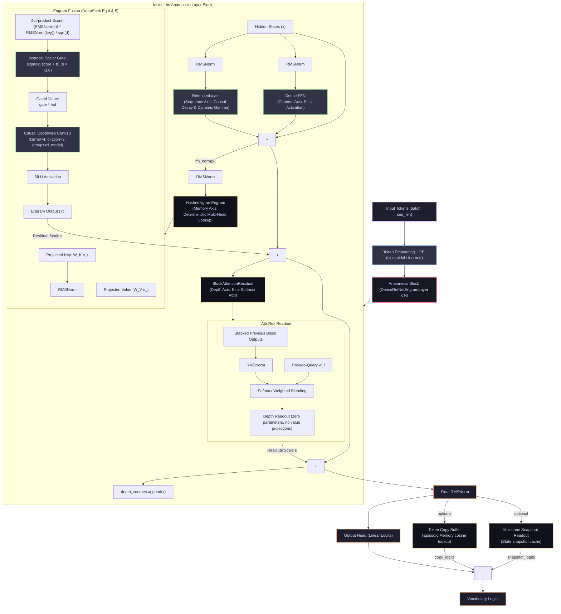

<div align="center">

# Anamnesis

🚀 **A Proof-Aligned PyTorch Research Scaffold for Budgeted Long-Context Memory** 🚀

[](https://doi.org/10.5281/zenodo.20041183)
[](LICENSE)
[](https://github.com/XXY-CH/Anamnesis/actions/workflows/ci.yml)
[](pyproject.toml)
[](requirements.txt)

*Weaving RetNet Temporal Recurrence, Depth-Axis Attention Residuals, and Hashed N-gram Memory Lookup into a Unified Sparse Architecture.*

</div>

---

## 📖 Introduction: The Philosophy of Recall

In ancient Greek philosophy, **Anamnesis** (ἀνάμνησις) is the concept that humans possess innate, structural knowledge, and learning is simply the process of *recalling* or retrieving these memories. 

Modern Large Language Models (LLMs) violate this principle by simulating memory through expensive runtime computation: resolving a common multi-token entity consumes multiple early layers of attention and feed-forward networks, essentially reconstructing static facts on the fly.

**Anamnesis** is an early-stage deep learning research scaffold built to investigate a complementary axis of sparsity: **decoupling static memory lookup from dynamic compositional reasoning**. By introducing sparse, deterministic lookups alongside temporal recurrence and depth-wise cross-layer routing, we design an efficient model capable of long-context recall under strict computational and parameter budgets.

> [!IMPORTANT]
> **Core Scientific Objective**
> To study whether targeted, bounded auxiliary-memory paths can achieve near-perfect long-context needle recall ($EM=1.0$) without requiring the expensive memory footprint of a dense, full KV cache over every preceding token.

---

## 🛠️ The Three Axes of Sparsity

Anamnesis structures information flow along three orthogonal geometric axes:

```text
               ▲ Depth Axis: Block Attention Residuals (Kimi Style)
               │ (Softmax depth-wise cross-layer routing)
               │
               │         Memory Axis: Hashed N-gram Engram (DeepSeek Style)
               │       ╱ (Deterministic sparse O(1) semantic prefetch)
               │     ╱
               │   ╱
               │ ╱
───────────────┼────────────────────────► Sequence Axis: RetNet Recurrence
               │ (Streaming horizontal causal decay & dynamic gamma)
```

1.  **Horizontal Sequence Axis (RetNet Recurrence)**: Handles sequential, causal streaming using decay-weighted recurrence with $O(1)$ inference cost. It supports both fixed decay rates and dynamic input-dependent decay rates (analogous to Mamba's time-selection).
2.  **Vertical Depth Axis (Block Attention Residuals)**: Replaces standard uniform residual addition with zero-parameter softmax attention over preceding block representations, enabling deep layers to selectively retrieve early representations without feature dilution.
3.  **Orthogonal Memory Axis (Hashed Engram Lookup)**: Modernizes classic N-gram embeddings by mapping local contexts deterministically into sparse embedding tables via multi-head hashing. Extracted priors are fuzed via an **isotropic scalar gate** (Eq 4) and a **causal depthwise Conv1D** (Eq 5) to preserve semantic direction.

---

## 📊 Architecture At A Glance

Our unified architecture coordinates the sequence, depth, and memory axes:



---

## 🗺️ Repository Map: Architectural Blueprint

The codebase is structured logically to separate the runtime engine from mathematical proofs and diagnostics:

```text
anamnesis/
├── 🧠 Core Engine
│   ├── src/layers/        # Primitives: Retention, Engram, AttnRes, Copy Buffer
│   ├── src/models/        # Full model scaffolds (RetNetEngram, baselines)
│   └── src/training/      # Optimization loops and synthetic LM supervisors
├── 🔬 Diagnostics & Eval
│   ├── experiments/       # Synthetic runners & task configs (YAML/JSON)
│   ├── analysis/          # Notebooks and visualization utilities
│   └── tests/             # Pytest suite & paper-faithfulness contracts
└── 📖 Theory & Proofs
    ├── docs/proofs/       # Mathematical proofs (Registry, Proofs 1-42)
    ├── docs/progress/     # Core technical roadmaps and ADRs
    ├── papers/            # Extracted reading notes on reference papers
    └── references/        # BibTeX citations and bibliographic records
```

### 🧠 Core Engine
*   **[src/layers/](src/layers/README.md)**: Custom deep learning layers. Includes `HashedNgramEngram` (lookup, scalar gate, and causal 1D Conv), `BlockAttentionResidual` (zero-parameter softmax depth-axis router), `RetentionLayer` (streaming parallel/recurrent mixing), and `TokenCopyBuffer` (precise episodic memory).
*   **[src/models/](src/models/README.md)**: Full architecture definitions, implementing the unified `RetNetEngramModel` and standard Transformer benchmarks.
*   **[src/training/](src/training/README.md)**: Synthetic dataset pipelines, loss functions, and optimization loops.

### 🔬 Diagnostics & Evaluation
*   **[experiments/](experiments/README.md)**: Command-line runners and YAML configurations for long-context evaluations (e.g., Synthetic Needle tasks).
*   **[analysis/](analysis/README.md)**: Scientific plotting scripts and notebooks to generate publication-quality figures.
*   **[tests/](tests/README.md)**: Comprehensive pytest suite, including `test_paper_faithfulness.py` validating architectural constraints.

### 📖 Theory & Mathematical Documentation
*   **[docs/proofs/](docs/proofs/README.md)**: The formal proof trail tracking all 42 proofs. Includes [00-proof-status-registry.md](docs/proofs/00-proof-status-registry.md) for verification status.
*   **[papers/](papers/README.md)**: Summaries and reading notes on core reference materials.
*   **[references/](references/README.md)**: Citation lists and BibTeX metadata.

---

## 🚀 Installation & Quickstart

Initialize a local virtual environment and install the package in development mode:

```bash
python -m venv .venv
source .venv/bin/activate
python -m pip install --upgrade pip
python -m pip install -e ".[dev]"
```

For a minimal production environment:

```bash
python -m pip install -r requirements.txt
```

---

## 🧪 Verification & Faithfulness Contracts

Our codebase enforces **Paper-Faithfulness Contracts** via unit tests to prevent architectural drift during optimization. Run the full pytest suite to verify:

```bash
python -m ruff check .
python -m black --check .
python -m pytest
```

Expected baseline: **all 25 tests pass**. The suite checks:
1.  **Engram Faithfulness**: Verifies Key RMSNorm alignment, direct lookup projections, and causal depthwise `Conv1d` properties.
2.  **AttnRes Faithfulness**: Verifies zero-parameter softmax depth-axis attention with no value/output projections.
3.  **Recurrence Invariance**: Asserts that recurrent inference state size remains $O(1)$ and matches parallel training outputs.

---

## 🏃 Running Synthetic Diagnostics

To evaluate long-context needle recall, run a localized diagnostic training run:

```bash
python experiments/train_synthetic.py \
  --task needle \
  --variants ours,retnet,transformer \
  --steps 200 \
  --batch-size 4 \
  --seq-len 128 \
  --log-interval 10 \
  --out-dir experiments/results/needle_smoke
```

To run a long-context ablation evaluating milestone snapshot readout gates:

```bash
python experiments/train_synthetic.py \
  --task needle \
  --variants ours_snapshot_logits,retnet,transformer \
  --use-milestones \
  --use-snapshots \
  --use-snapshot-logit-bias \
  --steps 200 \
  --eval-batches 4 \
  --out-dir experiments/results/snapshot_ablation
```

---

## 🎓 The Proof Trail

We maintain a rigorous mathematical proof trail in [docs/proofs/](docs/proofs/README.md) to anchor our engineering decisions:

1.  **[00-proof-status-registry.md](docs/proofs/00-proof-status-registry.md)**: Living status tracker for all 42 proofs.
2.  **[Proof 40 (Scalar Gating)](docs/proofs/40-scalar-gating-lower-bound.md)**: Derives the gradient vanishing bound $\|\nabla_{W_K} \mathcal{L}\| \leq s \cdot e^b \cdot C$ and proves that scalar gating preserves semantic directions.
3.  **[Proof 41 (RAG Separation)](docs/proofs/41-rag-separation-principle.md)**: Mathematically proves why uncontextualized token readout collapses on natural language manifolds due to rank deficiency and Jacobian context collapse.
4.  **[Proof 42 (OOD Phase Scrambling)](docs/proofs/42-rope-snr-collapse.md)**: Formulates how ultra-long context extrapolation wraps high frequencies, scrambling the query-key semantic coordinate space.

---

## 📄 Citation

If Anamnesis contributes to your academic research, please cite our repository using the Zenodo DOI:

```bibtex
@software{xie_2026_anamnesis,
  author = {Xie, Xingyu},
  title = {A Conditional Small-State Memory Architecture for Efficient Long-Context Reasoning},
  year = {2026},
  doi = {10.5281/zenodo.20041183},
  url = {https://github.com/XXY-CH/Anamnesis},
  license = {CC-BY-4.0}
}
```

Metadata is also available in standard CFF format in [CITATION.cff](CITATION.cff).

---

## 🪪 License

Creative Commons Attribution 4.0 International (`CC-BY-4.0`). See [LICENSE](LICENSE) for details.
